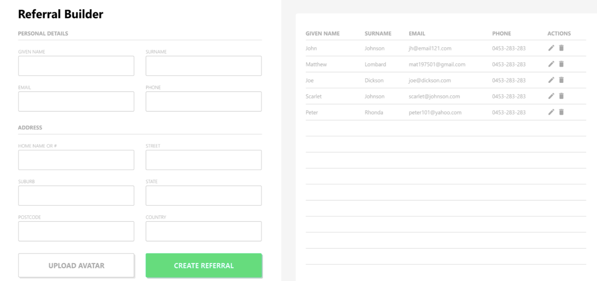
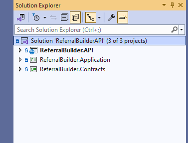
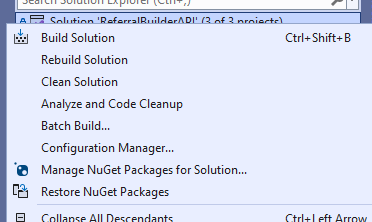

# Referral Builder

## Todo:

Build the Referral Builder frontend app based on design
Create a simple REST API that would allow creating and reading referrals

## Requirements:

1. As the form is filled out, the preview should be automatically updated
2. The Create button should function to call the Create Referral API endpoint
3. The app should be responsive for different screen widths
4. The form should work in the latest Chrome browser

## Guidelines:

1. Use React as a base library. Feel free to use any react library to complete this task
2. We are interested in your coding style and how you solve problems. To this end, please include your source code and any
   build steps / explanations / set up instructions we may need to test the submission
3. Please structure the code for reusability

## Submission:

- Please submit a complete copy of the source code you wrote for this test.
- Upon submission, please also give us a guide as to how long you spent on the test (there is no wrong answer! We iterate on this test
  based on the average time taken so we can provide an accurate time-frame for future candidates).
- Submission should be pushed to the Git. Just make sure it has public access. (GitHub, Gitlab, etc - your call!)
   
  

## Installation Requirements:

1. Nodejs [Nodejs](https://nodejs.org/en)
2. Docker Desktop [DockerDesktop](https://www.docker.com/products/docker-desktop/)
3. Visual Studio Code [VSCode](https://code.visualstudio.com/)
4. Visual Studio 2022 (Community Edition) [VS2019](https://visualstudio.microsoft.com/)

## Run Front-end

1. Navigate to referral-builder folder
2. Run `npm install` on terminal
3. Run `npm run dev`
4. Open on [DevLink](http://localhost:3000/)

## Run Back-end

1. Navigate to ReferralBuilderAPI
2. Open Solution **ReferralBuilderAPI.sln**
3. Restore Nuget Packages
    
   
    
   

4. Navigate to ReferralBuilder.Application
5. Open in terminal
6. Run `docker-compose up`
7. Press f5 or Run from Toolbar

## Notes - Time it took to develop (16-20hrs)

- Build steps:
- Create the react project with vite as base framework
- Create initial state of repository
- Install tailwindcss (Main css design framework used)
- Install HeadlessUI (Unstyled React components as baseline for styling)
- Get colors and typography from original design
- Create and design layout (including preliminary responsiveness of components and layouts), Routes were forgoed for now due to only having one page.
- Create design re-useable form components
- Added basic models
- Added reducer functionalities (edit existing record using pencil, create new record, clear edited record, live update of table with inputs)
- Integrated state and reducer dispatch functionalities to form and table
- Added upload image functionality
- Added image cropping functionality for standardization + display of uploaded image
- Added form validations and messages
- Added input sanitation
- Introduced react query (static data initially) for getting records
- Added static way of pulling records, updating, creating and deleting for checking functionality
- Integrated loading state of mutations and queries to application
- Updated cropping functionality to store base64 string for easier storing
- Created basic RestApi Project using Visual Studio
- Created Contracts Project, Api Project, and Applications Project
- Contracts Project hold Request and Response Models to and from the API project and Front-end
- Added Database Initialization (Create and Initialization of data) (Postgres)
- Created Repository + Service Pattern for data transfer (separation of concerns)
- Added Crud functionality to repository, Added service layer but mostly pass over
- Added Controllers + Endpoint
- Tested full Crud functionality using swagger before integrating back to front-end
- Updated static calls in react query to actual api endpoint
- Added cors configuration to allow frontend to call api endpoints
- Enforced port numbers for front-end and backend projects
- Added some animations on deleting record
- Responsive design for smaller screen was not available to took creative liberty to some regards
- Re-usable components are core of development
- Tweaked responsiveness user experience of the sidebar
- Create readme file

## Could Haves

### Front-end

- Automated testing
- Pagination functionality
- Button feedback when form is invalid on submit (Shake animation or something)
- Put the referral record into an appcontext then put the table in a different file
- Only pull avatar data when editing records
- Improve spacing on some of the form components
- Make the headers sticky when on smaller screen

### Back-end

- Add fluent validations to Rest API application
- Implement pattern to remove magic strings in API App
- Add automated tests to API calls
- Add way populate more data in db
- Change pattern used to use Entity Framework
- Integrate Caching on API side
- Add authentication
- Add authorization
- Add api versioning
- Add standard validation message
- Extend swagger functionality (more visibility on return types of endpoints)
